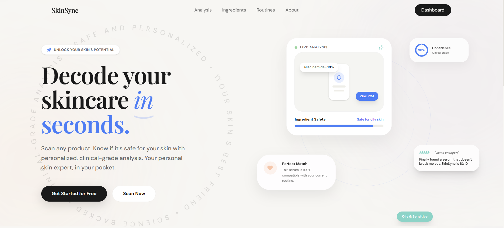
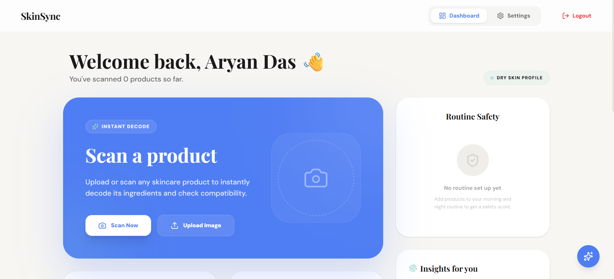
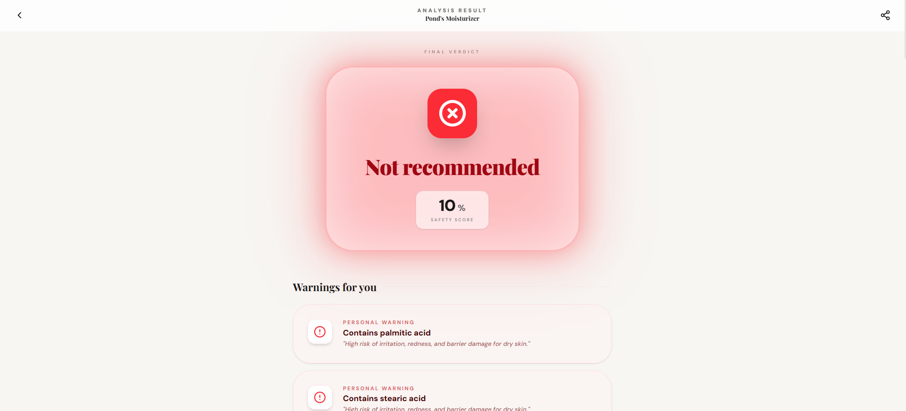

# SkinSync 🧴🔍

**SkinSync** is an AI-powered skincare analysis web app that scans product ingredient labels and determines whether they are compatible with a user’s skin type.

It uses **local AI models running directly in the browser** to extract ingredient data, analyze ingredient interactions, and generate personalized skincare insights.

Built for **HackXtreme Hackathon at GeeksforGeeks, Noida**.

🌐 **Live Demo:**  
https://skin-sync-orcin.vercel.app/

---

# 🚀 Features

## 📷 Ingredient Scanner
Users can analyze products using three input methods:

- Upload an ingredient label image
- Capture an image using the device camera
- Paste ingredient text manually

The app extracts the ingredient list using **OCR and vision models running locally**.

---

## 🧑‍⚕️ Personalized Skin Profile

Users create a profile including:

- **Skin Type** (Oily / Dry / Combination / Sensitive)
- **Ingredient Sensitivities**
- **Current Active Ingredients** (Retinol, AHA/BHA, etc.)

This profile powers **personalized compatibility analysis**.

---

## 🧠 AI Ingredient Intelligence

SkinSync decodes complex **INCI ingredient lists** and provides:

- Ingredient explanations
- Skincare benefits
- Potential irritants
- Skin type compatibility

---

## ⚠️ Ingredient Interaction Detection

The system identifies potentially harmful ingredient combinations such as:

- Retinol + AHA/BHA
- Retinol + Benzoyl Peroxide
- Vitamin C + certain actives

This helps users **avoid routines that may damage their skin barrier**.

---

## 🧴 Product Comparison

Users can compare **two skincare products** to determine:

- Which product is safer
- Ingredient differences
- Interaction risks

---

## 📋 Skincare Routine Analysis

SkinSync analyzes a user’s **entire skincare routine** to detect conflicts between products and active ingredients.

---

## 🚨 Personalized Warnings

If a product contains ingredients the user marked as sensitivities, SkinSync flags them immediately.

Example:

> ⚠ **Contains Fragrance**  
> You marked fragrance as a sensitivity.

---

## ✅ Final Safety Verdict

Each product receives a clear verdict:

- 🟢 **Safe**
- 🟡 **Use With Caution**
- 🔴 **Avoid**

This allows users to make decisions **quickly and confidently**.

---

# 🧠 How It Works

SkinSync runs **AI inference locally in the browser** using the RunAnywhere SDK.

```
Image / Text Input
↓
Vision Model + OCR
↓
Ingredient Extraction
↓
Ingredient Database Matching
↓
LLM Ingredient Analysis
↓
Interaction Detection
↓
User Profile Compatibility Check
↓
Safety Verdict
```

All processing happens **client-side**, ensuring user privacy.

---

# 🏗 Tech Stack

## Frontend
- React + Vite
- TailwindCSS
- Framer Motion
- Lucide React Icons

## AI / ML
- RunAnywhere SDK
- Vision Language Model (VLM)
- Local LLM for reasoning
- Tesseract.js for OCR

## Data
- Ingredient database
- Interaction rules dataset

## Deployment
- Vercel

---

# ⚙️ Installation

1. Clone the repository:

```bash
git clone https://github.com/aryandas2911/SkinSync.git
```

2. Navigate to the project directory:
```bash
cd skinsync
```

3. Install dependencies:
```bash
npm install
```

4. Start the development server:
```bash
npm run dev
```

---

# 🧪 Example Workflow
- User completes onboarding and sets a skin profile.
- User scans a product ingredient label.
- OCR extracts ingredient text locally.
- Vision and language models interpret ingredients.
- Interaction engine checks for conflicts.
- Compatibility is evaluated against the user profile.
- The app generates a final safety verdict.

---

# 📸 Screenshots

Landing Page



Dashboard



Product Analysis Results



---

# 🔒 Privacy First

SkinSync is designed to be privacy-focused.

AI models run locally in the browser
No ingredient images are uploaded to external servers
User skin profile is stored locally on the device

This ensures sensitive skin data remains private.

---

# 💰 Business Model

SkinSync follows a multi-tier revenue model.

1. Freemium Tier: Basic ingredient scanning and compatibility checks.
2. Premium Subscription: Advanced routine analysis and unlimited scans.
3. Dermatology Clinic SaaS: White-label tool for dermatologists to analyze patient products.
4. Skincare Brand API: Brands integrate SkinSync to check product compatibility for customers.
5. Affiliate Product Recommendations: Suggest safer alternatives when a product is not suitable.

---

# 🚀 Future Improvements

- Skin condition detection using computer vision
- Real-time product barcode scanning
- Ingredient risk scoring
- Multi-product routine optimization
- Dermatologist integration tools

---

# 👥 Team

Built for HackXtreme Hackathon at GeeksforGeeks, Noida

Team Members:
- Sandra Rosa Prince
- Bhumika Bindal
- Tanushree Dhawan
- Aryan Das
